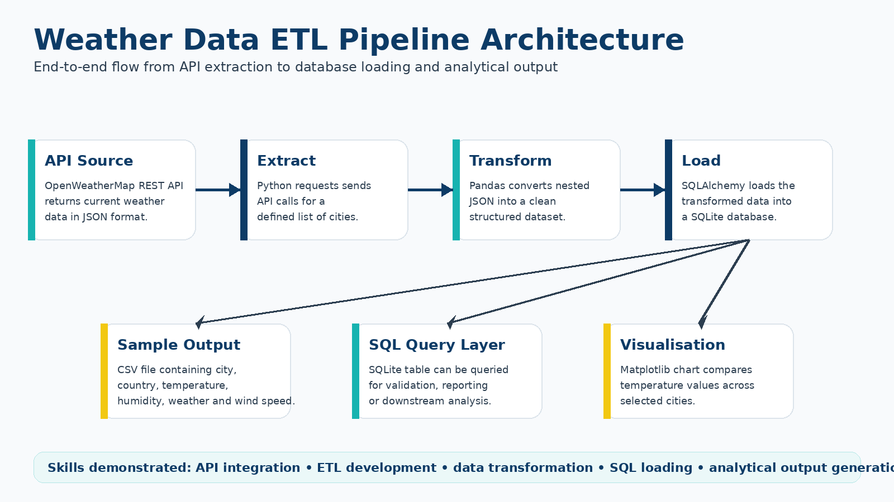
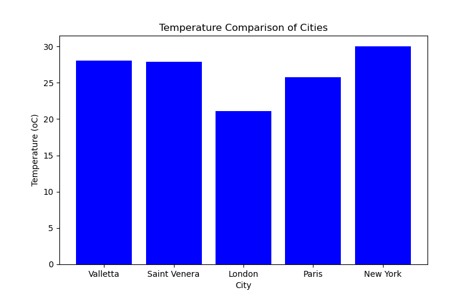

# Weather Data ETL Pipeline


## Overview

This project demonstrates the implementation of a simple end-to-end ETL pipeline using Python.

Weather data is extracted from the OpenWeatherMap API, transformed into a structured tabular dataset using Pandas, loaded into a SQLite database using SQLAlchemy, queried using SQL, and visualised using Matplotlib.

The project was developed as a portfolio example to demonstrate practical skills in API integration, data transformation, database loading, and analytical output generation.

## Technologies Used

- Python
- OpenWeatherMap API
- Pandas
- Requests
- SQLAlchemy
- SQLite
- Matplotlib
- python-dotenv

## Project Architecture



## ETL Process

### 1. Extract

The pipeline sends requests to the OpenWeatherMap API for a predefined list of cities and retrieves current weather data in JSON format.

### 2. Transform

The raw JSON responses are transformed into a structured dataset containing selected fields such as:

- Country
- City
- Temperature
- Humidity
- Weather description
- Wind speed

### 3. Load

The transformed dataset is loaded into a SQLite database table for storage and querying.

### 4. Visualise

A simple bar chart is generated to compare temperatures across the selected cities.

## Sample Output

The transformed output contains one record per city.

| country | city | temperature | humidity | weather | wind_speed |
|---|---|---:|---:|---|---:|
| MT | Valletta | 28.06 | 64 | clear sky | 3.95 |
| MT | Saint Venera | 27.92 | 64 | clear sky | 4.00 |
| GB | London | 21.11 | 49 | overcast clouds | 2.24 |
| FR | Paris | 25.75 | 35 | broken clouds | 1.79 |
| US | New York | 29.99 | 45 | overcast clouds | 4.92 |

## Visualisation



## Repository Structure

```text
weather-data-etl-pipeline/
│
├── README.md
├── requirements.txt
├── .gitignore
├── .env.example
│
├── src/
│   └── weather_pipeline.py
│
├── data/
│   └── sample_output.csv
│
└── images/
    ├── weather-etl-banner.png
    ├── weather-etl-architecture.png
    └── temperature-comparison-chart.png
```

## How to Run the Project

### 1. Clone the repository
```text
git clone https://github.com/vanessa-azzopardi/etl-pipeline.git
cd etl-pipeline
```


### 2. Install dependencies

`pip install -r requirements.txt`


### 3. Create an environment file

Create a .env file in the project root and add your OpenWeatherMap API key:

OPENWEATHER_API_KEY = your_api_key_here


### 4. Run the pipeline
`python src/weather_pipeline.py`


## Skills Demonstrated

- ETL pipeline development
- REST API integration
- JSON data extraction
- Data transformation using Pandas
- Database loading using SQLAlchemy
- SQL querying
- Data visualisation
- Secure handling of API keys using environment variables
- Repository organisation and documentation


## Notes

This project uses public weather data from the OpenWeatherMap API. API credentials are not stored in the repository. A .env.example file is included to show the required environment variable structure.

